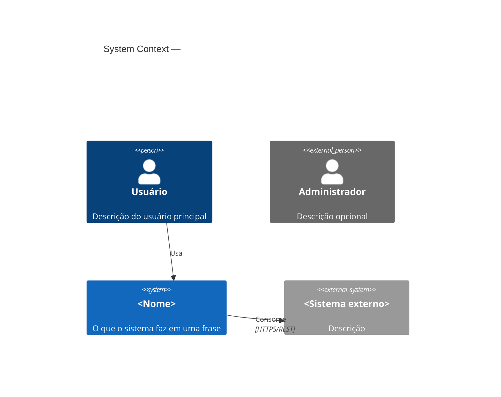
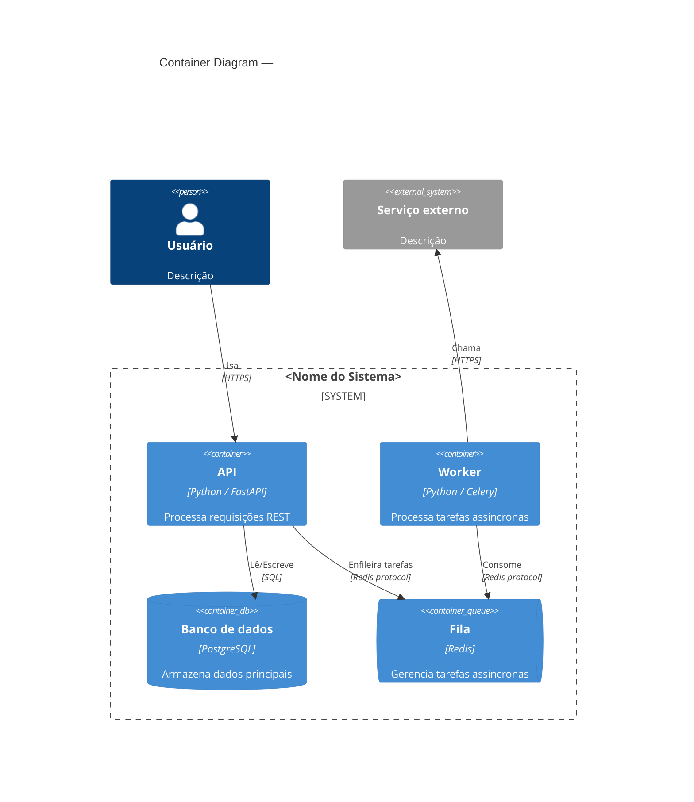
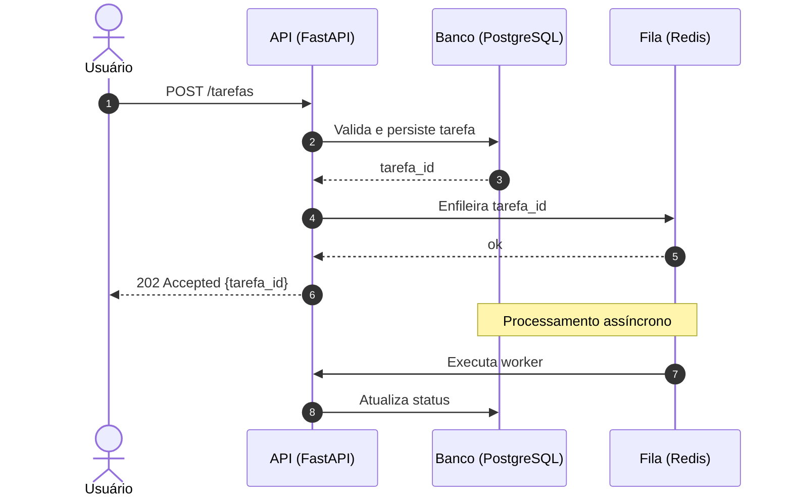

## O que faço

Gero diagramas de arquitetura em Mermaid e os salvo nos locais corretos do projeto.

## Onde salvar

| Tipo | Local | Quando |
|---|---|---|
| C4 L1 — contexto | `docs/diagrams/c4-context.md` | Projeto novo ou mudança de atores externos |
| C4 L2 — containers | `docs/diagrams/c4-containers.md` | Projeto novo ou mudança de containers |
| Sequência | inline no ADR relacionado em `.opencode/docs/adr/` | Ao criar um ADR que descreve um fluxo |

## C4 L1 — Diagrama de contexto

Mostra o sistema e seus atores externos. Não entra em detalhes internos.



**Regras L1:**
- Máximo de 5-6 elementos no total
- Sem detalhes internos (sem bancos, sem serviços internos)
- Foco em quem usa e com o que o sistema se comunica

## C4 L2 — Diagrama de containers

Mostra os containers (apps, bancos, filas) dentro do sistema.



**Regras L2:**
- Mostrar apenas containers — não classes, não funções
- Cada container: nome, tecnologia, responsabilidade em uma frase
- Incluir bancos, filas, caches como containers separados
- Não detalhar implementação interna

## Diagrama de sequência UML

Usado inline em ADRs para descrever fluxos de chamadas entre componentes.



**Regras de sequência:**
- Usar `autonumber` sempre — facilita referência no texto
- `->>` para chamadas síncronas, `-->>` para respostas
- `--)` para chamadas assíncronas (fire and forget)
- `Note over` para explicar etapas importantes
- Máximo de 10-12 steps por diagrama — quebrar em diagramas menores se necessário
- Participantes com nome legível + tecnologia entre parênteses

## Estrutura dos arquivos gerados

### `docs/diagrams/c4-context.md`
```markdown
# C4 L1 — Contexto do sistema

> Atualizado em: YYYY-MM-DD

\`\`\`mermaid
C4Context
  ...
\`\`\`

## Atores
- **Usuário**: descrição
- **Sistema externo**: descrição e por que existe essa dependência
```

### `docs/diagrams/c4-containers.md`
```markdown
# C4 L2 — Containers

> Atualizado em: YYYY-MM-DD

\`\`\`mermaid
C4Container
  ...
\`\`\`

## Containers
| Container | Tecnologia | Responsabilidade |
|---|---|---|
| API | FastAPI | ... |
| DB | PostgreSQL | ... |
```

### ADR com diagrama de sequência inline
```markdown
# 003 — Título da decisão

## Contexto
...

## Fluxo

\`\`\`mermaid
sequenceDiagram
  ...
\`\`\`

## Decisão
...
```

## Quando atualizar os diagramas

- C4 L1: quando mudar atores externos ou o propósito do sistema
- C4 L2: quando adicionar, remover ou renomear um container
- Sequência: quando o fluxo descrito no ADR mudar — atualizar inline no mesmo ADR
