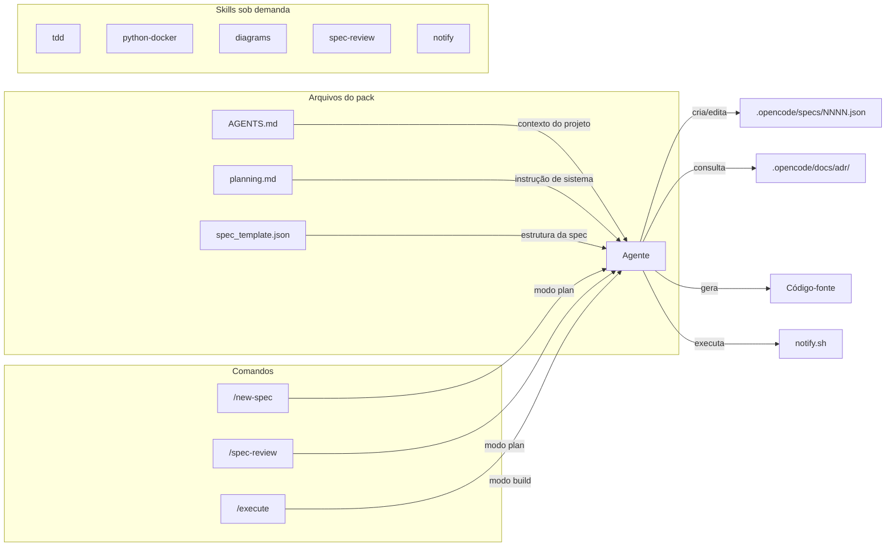
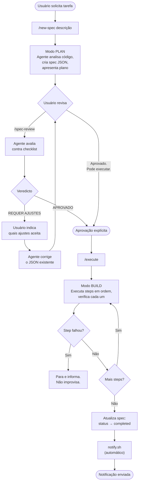
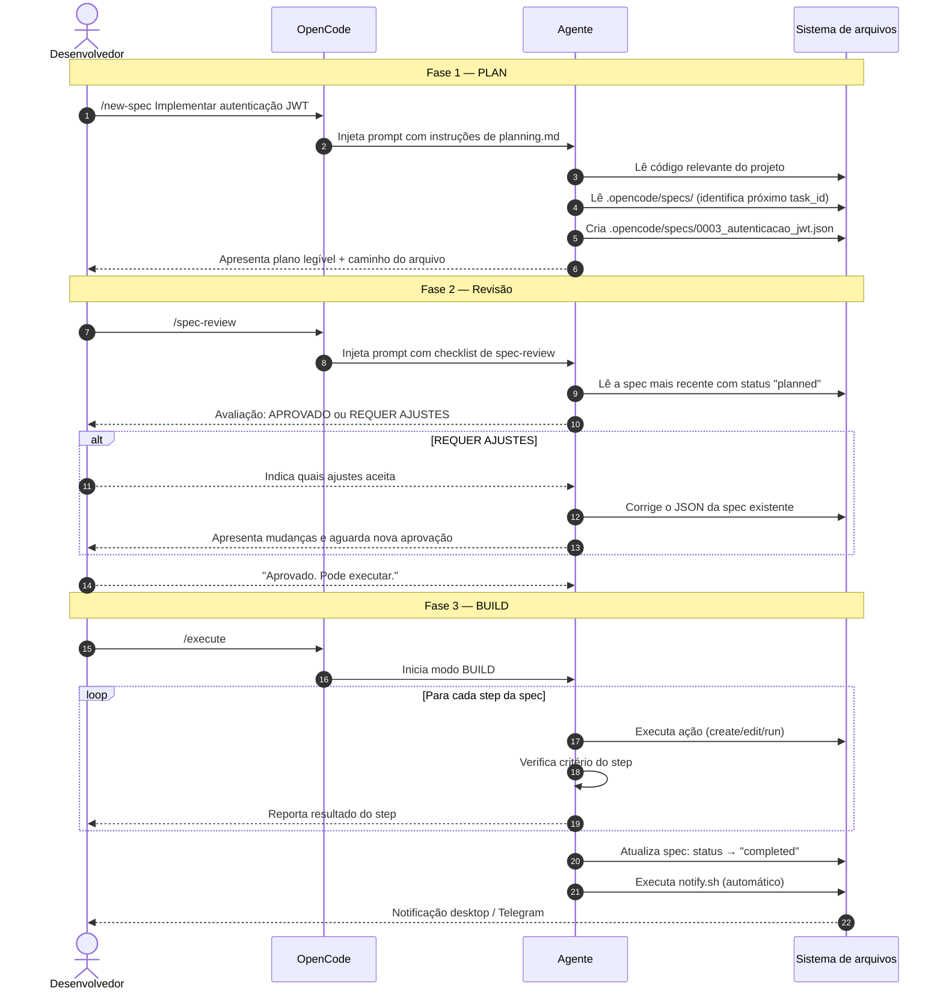
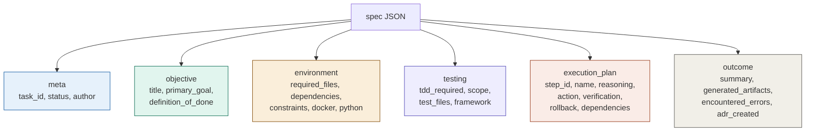
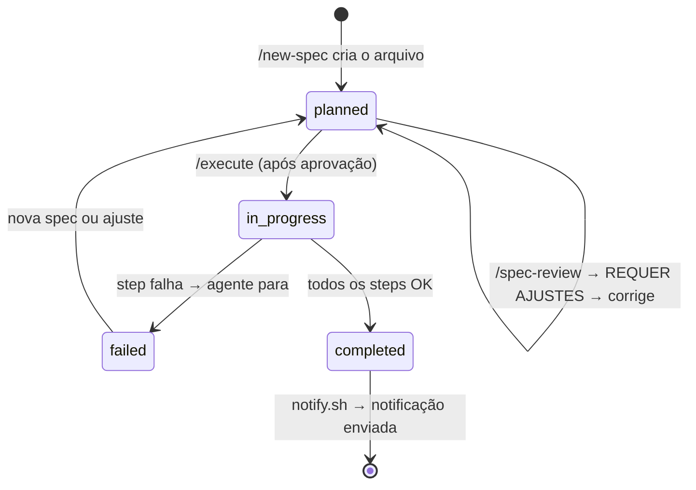
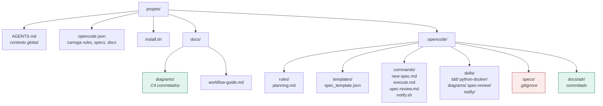

# Documentação do opencode-pack

> Protocolo Spec-First para projetos com [OpenCode](https://opencode.ai)

---

## O que é o opencode-pack

Um bootstrap que impõe disciplina de planejamento em agentes de codificação. Toda tarefa passa por um plano aprovado antes de qualquer linha de código ser escrita.

O pack fornece:
- Um protocolo de planejamento (`planning.md`) carregado automaticamente como instrução de sistema
- Um template de especificação (`spec_template.json`) que o agente deve preencher
- Comandos (`/new-spec`, `/spec-review`, `/execute`) que guiam o fluxo de trabalho
- Skills sob demanda (TDD, Docker/Python, diagramas, revisão de specs)

---

## Arquitetura do pack

---

## Fluxo completo do protocolo Spec-First

---

## Diagrama de sequência

---

## Estrutura de uma spec

---

## Ciclo de vida de uma spec

---

## Comandos disponíveis

| Comando | Agente | O que faz |
|---|---|---|
| `/new-spec <descrição>` | `plan` | Inicia o modo PLAN e cria a spec JSON |
| `/spec-review` | `plan` | Revisa a spec mais recente contra o checklist |
| `/execute` | `build` | Executa a spec aprovada e notifica ao concluir |

---

## Skills disponíveis

| Skill | Quando usar |
|---|---|
| `tdd` | Lógica de negócio isolada, funções puras, parsers, validações, ETL transforms |
| `python-docker` | Criar ou ajustar Dockerfile, docker-compose, ambientes Python |
| `diagrams` | Gerar diagramas C4 L1/L2 ou sequência com Mermaid |
| `spec-review` | Validar uma spec antes de aprovar execução |
| `notify` | Referência de configuração das notificações automáticas |

---

## Estrutura de diretórios do pack

---

## Regras fundamentais

1. **Nunca codifique sem spec aprovada.** Sem exceções.
2. No modo PLAN, a única permissão de escrita é criar e editar o arquivo de spec.
3. Cada step deve ter `reasoning` preenchido — justificativa técnica real, não genérica.
4. O `definition_of_done` deve ser verificável — evite critérios vagos.
5. Se um step falhar no BUILD, o agente para e informa — não improvisa.
6. Notificação é automática ao concluir o `/execute`.

---

## Notificações

O `/execute` chama `notify.sh` automaticamente ao concluir. Prioridade:

1. **Telegram** — se `TELEGRAM_BOT_TOKEN` e `TELEGRAM_CHAT_ID` estiverem no `.env`
2. **notify-send** — notificação desktop Linux
3. **Terminal** — fallback se nenhum dos anteriores estiver disponível

---

## Quando criar um ADR

Crie um ADR em `.opencode/docs/adr/NNN_<decisao>.md` quando:
- Escolher entre duas ou mais abordagens arquiteturais
- Adicionar uma dependência significativa
- Mudar um padrão existente do projeto
- A decisão tiver impacto duradouro e não for óbvia
