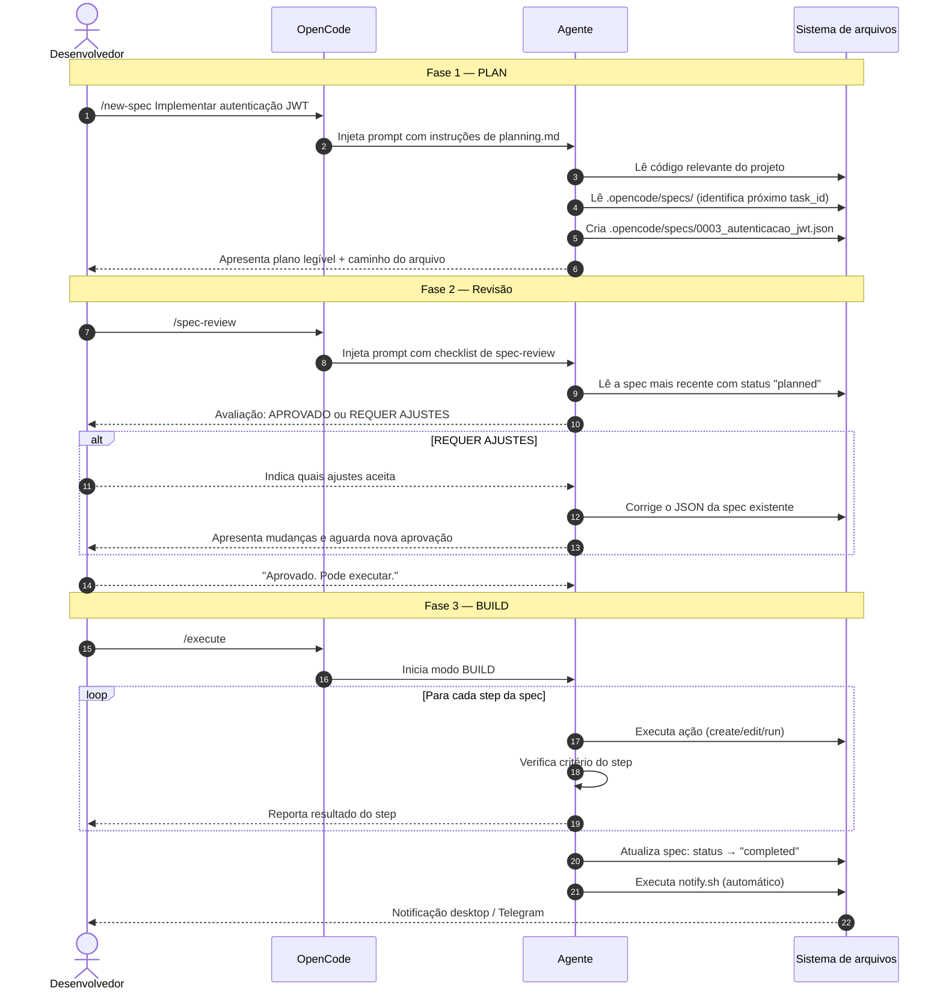

# Guia rápido: fluxo de trabalho Spec-First

> Este guia mostra o fluxo prático do dia a dia usando os comandos do opencode-pack.

---

## Visão geral

O protocolo Spec-First garante que toda tarefa passe por três fases antes de qualquer código ser escrito:

1. **PLAN** — você descreve o que quer; o agente analisa o código, cria a spec e apresenta o plano.
2. **Revisão** — você lê, ajusta se necessário, e aprova explicitamente.
3. **BUILD** — o agente executa passo a passo, verifica cada step e registra o resultado.

---

## Comandos disponíveis

| Comando | O que faz | Quando usar |
|---|---|---|
| `/new-spec <descrição>` | Inicia o modo PLAN e cria a spec JSON | Sempre que quiser iniciar uma nova tarefa |
| `/spec-review` | Revisa a spec mais recente contra um checklist | Antes de aprovar, especialmente em tarefas críticas |
| `/execute` | Inicia o modo BUILD da spec aprovada e notifica ao concluir | Após aprovar o plano |

---

## Fluxo passo a passo

### 1. Criar a spec

```bash
/new-spec Implementar autenticação JWT
```

O agente vai:
- Analisar o código relevante do projeto
- Identificar o próximo `task_id` sequencial em `.opencode/specs/`
- Criar o arquivo `.opencode/specs/NNNN_autenticacao_jwt.json`
- Apresentar o plano de forma legível

> ⚠️ O agente **deve criar o arquivo JSON** antes de apresentar o plano. Se ele apenas descrever em texto sem criar o arquivo, é uma violação do protocolo — peça para ele criar o arquivo.

### 2. Revisar a spec (opcional, recomendado)

```bash
/spec-review
```

O agente avalia a spec contra o checklist:
- Estrutura e campos obrigatórios preenchidos
- Steps com justificativa técnica real
- TDD marcado corretamente
- Dependências Docker/serviços verificadas
- Rollback definido nos steps críticos

O veredicto será **APROVADO** ou **REQUER AJUSTES**.

Se REQUER AJUSTES:
1. O agente lista os problemas e sugestões.
2. Você indica quais ajustes aceita.
3. O agente corrige o JSON da spec existente (não cria uma nova).
4. Apresenta as mudanças e aguarda nova aprovação.

### 3. Aprovar

Após revisar, diga explicitamente:

```
Aprovado. Pode executar.
```

> O agente **não deve iniciar execução sem sua aprovação explícita**.

### 4. Executar

```bash
/execute
```

O agente:
- Executa os steps em ordem, respeitando dependências
- Verifica cada step contra seu critério de verificação
- Se um step falhar, para e informa — sem improvisar soluções fora do escopo
- Ao finalizar, atualiza o `outcome` da spec com `status: "completed"`
- **Notifica automaticamente** via desktop (notify-send) ou Telegram (se configurado no `.env`)

---

## Diagrama de sequência



---

## Dicas

- **Não pule o `/new-spec`**: mesmo para tarefas pequenas, a spec cria um registro do que foi planejado e executado.
- **Use `/spec-review` em tarefas críticas**: migração de banco, mudança de dependência, refatoração grande.
- **Se o agente travar no PLAN**: verifique se ele criou o arquivo JSON. Se não criou, lembre-o do protocolo.
- **Se um step falhar no BUILD**: o agente deve parar e informar. Não aceite que ele improvise — peça uma nova spec ou ajuste a existente.
